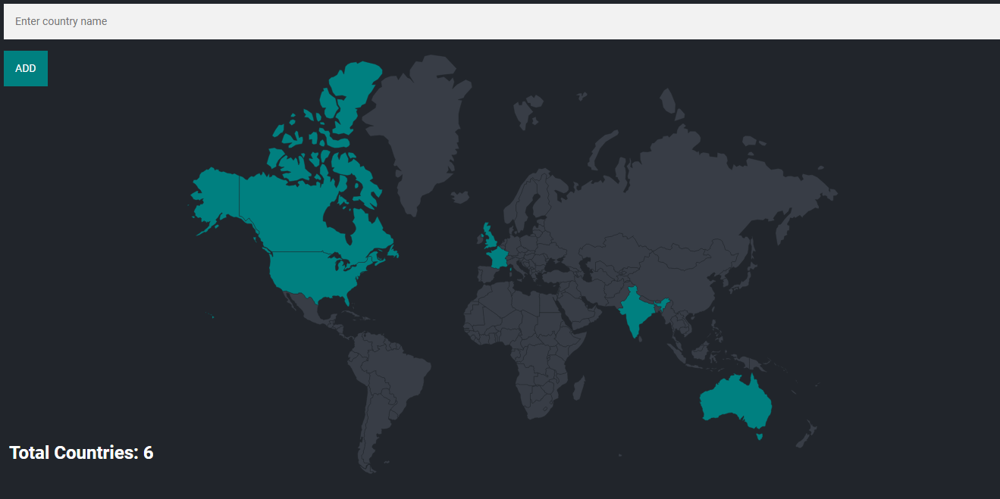

🌍 Travel Tracker Web Application

A full-stack web application to keep track of countries you’ve visited. Users can type in a country name, and it gets highlighted on a world map while updating the total count.

📌 Why I Built This Project

I built this project to strengthen my skills in backend development with Node.js and PostgreSQL while also working with frontend templating (EJS) and data visualization.

I wanted a project that goes beyond a basic to-do list and demonstrates database integration, server-side rendering, and interactive visualization.

This app combines my interests in travel + coding, making it a fun and practical way to learn full-stack development.

🛠 Technologies Used

Backend: Node.js, Express.js

Database: PostgreSQL

Frontend: EJS, [CSS]

Visualization: World map integration (Datamaps / D3.js)

Other Tools: body-parser, nodemon

📚 What I Learned

Through this project, I gained hands-on experience with:

Designing and querying relational databases with PostgreSQL.

Handling form submissions, validation, and error handling in Express.

Preventing duplicate entries and managing foreign key constraints.

Rendering dynamic content using EJS templates.

Integrating a visual layer (map highlighting) with backend-driven data.

Structuring a full-stack project for GitHub + deployment.

🚀 Features

Add countries by name (validated against PostgreSQL).

Prevents duplicates and invalid entries.

Highlights visited countries on a world map.

Displays total visited countries count.

Clean, simple UI for interactive use.

📂 Project Structure  
Travel-Tracker-Web-Application/ 
│── node_modules/         # Dependencies   
│── public/               # Static files (CSS, JS, images)   
│   └── styles/   
│       └── main.css      # Stylesheet   
│── views/                # EJS templates   
│   └── index.ejs         # Main page template   
│── index.js              # Express server entry point   
│── package.json          # Project metadata & dependencies   
│── package-lock.json   
│── schema.sql            # Database schema   
└── README.md             # Documentation   

▶️ Running the App

Clone the repo:

git clone https://github.com/suresh-2201/Travel-Tracker-Web-Application
cd Travel-Tracker-Web-Application

Install dependencies:

npm install

Start the server:

nodemon index.js

Open in browser:

http://localhost:3000

📸 Screenshots

Inspired by Angela Yu's Web Development Bootcamp.

Made with ❤️ by Suresh Kumar Prajapat C
